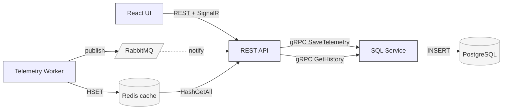

# Architecture Overview

Distributed industrial real-time telemetry platform meeting the assignment requirements: exactly 20 sensors, 1 reading/sec/sensor, telemetry originating in Redis, push-only UI updates via SignalR, backend services communicating only via gRPC + RabbitMQ.

## Components

### React + TypeScript UI (`frontend/`)
- Exactly 3 pages: **Dashboard**, **Sensor Details**, **System Status**.
- Uses REST only for metadata (`/api/sensors`, `/api/sensors/{id}/history`, `/api/health`) and a single admin call (`POST /api/admin/reset`).
- Uses SignalR (`/telemetryHub`) for live telemetry pushes.
- Uses Server-Sent Events (`/api/events/stream`) for the operational event log shown in the System Activity tab. This is observability metadata, not telemetry data.

### REST API service (`services/rest-api/`, C# / .NET 9)
- Hosts the SignalR `TelemetryHub` at `/telemetryHub`, broadcasting the `TelemetryUpdate` event.
- `RabbitMqTelemetryListener` consumes the `telemetry` queue. On each message: extracts `sensorId`, **reads** `sensor:{sensorId}` from Redis, pushes the result to SignalR, and persists it to sql-service over gRPC. Falls back to the rabbit payload if the Redis read fails.
- `SystemEventsListener` binds an exclusive queue to the `system.events` fanout exchange and forwards every published operational event into the in-process `SystemEventBus`. `SystemEventBus` then fans those events out to any HTTP client subscribed to the SSE endpoint. Event kinds observed in the wild: `redis_write`, `rabbit_publish`, `rabbit_consume`, `redis_read`, `redis_read_miss`, `signalr_push`, `grpc_save`, `postgres_write`, and `reset`.
- REST endpoints exposed to the UI: `GET /api/sensors`, `GET /api/sensors/{id}/history`, `GET /api/health`, `POST /api/admin/reset`, plus the SSE stream at `GET /api/events/stream`.
- `POST /api/admin/reset` iterates the 20 known sensor IDs and `KeyDeleteAsync("sensor:{id}")` on Redis (it does **not** issue a wildcard / `FLUSHDB`), then calls `ClearTelemetry` over gRPC to truncate the SQL table.

### SQL Data service (`services/sql-service/`, C# / EF Core / gRPC)
- gRPC service `TelemetryStore` (defined in `Protos/greet.proto` — name is a leftover from `dotnet new grpc` scaffolding; service inside is correctly named): `SaveTelemetry`, `GetSensorHistory`, `ClearTelemetry`.
- Backed by PostgreSQL via Entity Framework Core (`TelemetryContext` / `TelemetryEvent`).
- `ClearTelemetry` uses `ExecuteDeleteAsync` for a single-roundtrip `DELETE FROM "Telemetry"`.

### IoT Telemetry service (`services/telemetry-service/`, C# / BackgroundService)
- Simulates 20 sensors (`sensor-01` … `sensor-20`).
- Every second, **shuffles** the sensor list (`idList.OrderBy(_ => rng.Next())`) and for each sensor:
  1. `HashSetAsync sensor:{id} = { timestamp, value }` to Redis (origin/cache).
  2. `BasicPublishAsync` the full `TelemetryMessage` to the `telemetry` queue on RabbitMQ (trigger + durability + fallback payload).
  3. Publishes `redis_write` and `rabbit_publish` system events to the `system.events` fanout exchange via the shared `SystemEventPublisher` helper. Every backend service uses the same fanout exchange so the rest-api's `SystemEventsListener` sees a single stream regardless of producer.

### Infrastructure
- **Redis** — origin/cache: holds the latest reading per sensor.
- **RabbitMQ** — event bus: durable `telemetry` queue + `system.events` fanout exchange (the latter is observability metadata, not telemetry data).
- **PostgreSQL** — durable historical store, write-only from sql-service, read for `/history` endpoint.

### Deployment (`docker-compose.yml`)

All seven services run together on a single compose network. Host port → container responsibility:

| Service | Host port | Notes |
|---|---|---|
| frontend | `4173` | Vite preview build serving the React UI |
| rest-api | `5100` | REST + SignalR (`/telemetryHub`) + SSE (`/api/events/stream`) |
| sql-service | `5400` → 5000 | gRPC only; HTTP/2 |
| redis | `6379` | default |
| rabbitmq | `5672` + `15672` | AMQP + management UI |
| postgres | `5432` | DB `press`, user/pass `postgres/postgres` |
| telemetry-service | — | no exposed port (background worker) |

Service-to-service URIs are passed via environment variables (`RabbitMq:Url`, `Redis:Connection`, `SqlService:Url`, `Database:ConnectionString`) so docker-compose can wire them via container names. Each service waits for its dependencies with a retry loop rather than relying on healthcheck ordering, so the stack survives any startup order.

## Data flow

```
Telemetry-service tick (every 1s, sensor order shuffled):
    foreach sensor:
        HSET sensor:{id} = { timestamp, value }      ← Redis (cache)
        publish TelemetryMessage to "telemetry"      ← Rabbit (durable queue)

REST API consumer (per Rabbit message):
    sensorId ← message.SensorId
    value    ← redis.HashGetAll("sensor:{sensorId}")    ← happy path
              ?? rabbit payload                          ← fallback
    SignalR push "TelemetryUpdate" → all clients
    gRPC SaveTelemetry → sql-service → Postgres INSERT
```

Per the spec, the data path that serves the UI is `Redis → API → UI`. RabbitMQ is the trigger that satisfies "no polling" without coupling producers to consumers; it doesn't carry the canonical value in the happy path (though it has the payload as a fallback).

## Why each technology

- **Redis** — `O(1)` `HashGetAll` for the latest value per sensor. The cache holds only "what is the current value?" — a small, bounded read model that the spec explicitly names as the telemetry origin.

- **RabbitMQ** — durable, decoupled notification.
  - Satisfies "no polling" without requiring telemetry-service to know about consumers.
  - Buffers when rest-api is slow / restarting → no lost messages during deploys.
  - Competing-consumers pattern lets rest-api scale horizontally with no extra code.
  - Natural extension point for additional async subscribers (alerting, analytics, archival).
  - Provides a fallback payload if Redis is unhealthy.

- **gRPC** — strongly-typed contract for rest-api ↔ sql-service. Generated client + server stubs make refactors safe.

- **SignalR** — server-initiated push to the browser without polling; meets the spec constraint that the API↔UI live channel is SignalR.

## Trade-offs

- **Redis is not the system of record.** Postgres is. Redis loss means at-most ~1 second of missing UI updates (next tick rewrites it); historical data is unaffected.
- **Rabbit payload is technically redundant in the happy path** (rest-api reads Redis instead). Kept for resilience — if Redis is down, rest-api falls back to it so the UI keeps working.
- **`DELETE FROM Telemetry`** in `ClearTelemetry` is fine for the demo; in production we'd use `TRUNCATE` + partition-by-day so reset is cheap.
- **No outbox pattern.** If sql-service is down, the gRPC save call fails; that reading is lost from history. The mitigation would be an outbox table in rest-api drained by a separate worker — explicitly out of scope.

## Scaling for more sensors / higher rates

- **Telemetry workers**: partition sensor IDs across multiple worker pods (each owns a slice; Redis writes are key-scoped so no contention).
- **RabbitMQ**: switch to a quorum queue + mirror across nodes; competing-consumer rest-api replicas drain it concurrently.
- **Redis**: vertical first (single Redis handles huge throughput for hash writes), then Redis Cluster sharded by sensor ID prefix.
- **sql-service**: scale horizontally; partition the Telemetry table by `(sensor_id, day)` and use COPY-style bulk inserts; consider a time-series engine (Timescale, ClickHouse) past ~10k sensors.
- **rest-api**: scale horizontally with a SignalR backplane (Redis pub/sub via SignalR's built-in support, or Azure SignalR Service).

## Failure scenarios

| Failure | What still works | What breaks | Recovery |
|---|---|---|---|
| **Redis down** | UI live feed (falls back to rabbit payload); persistence to Postgres | "true" cache reads — system logs `redis_read_miss` events | Restart Redis; next tick re-populates |
| **RabbitMQ down** | Redis cache writes; UI shows stale data | SignalR pushes and Postgres saves stop | Reconnect; queued messages drain |
| **sql-service / Postgres down** | UI live feed | Persistence; `/history` endpoint | Restart; readings during downtime are lost (mitigation: outbox) |
| **rest-api restart** | Telemetry-service keeps writing Redis + Rabbit; no message loss | UI pauses; auto-reconnects | Backlog drains from Rabbit on startup |
| **Telemetry-service down** | Existing Redis cache stays until evicted | No new readings | Restart |

## Tests and CI

- `tests/restapi/`, `tests/sqlservice/`, `tests/telemetry/` — one xUnit project per backend service, referenced from `IndustrialRealTime.sln`. Currently scaffolded with placeholder unit tests; the structure is in place for per-service test growth. No dedicated integration-test project yet — end-to-end verification today is done by running the compose stack and watching the System Activity tab.
- `.github/workflows/ci.yml` runs on every push: restores + builds the .NET solution in Release, runs `dotnet test`, runs `npm install` + `npm run build` for the frontend, validates `docker-compose config`, and builds the per-service Docker images. CI failures block the build.

## Operational signals (recommended)

- **RabbitMQ**: queue depth, consumer lag, publish/ack failures, unrouted-message count.
- **Redis**: hit/miss rate (we already publish `redis_read_miss` events — promote to a Prometheus counter), connection health, memory usage.
- **gRPC**: per-RPC latency p50/p99, error rate, in-flight count.
- **SignalR**: connected client count, push latency, disconnect rate.
- **Telemetry-service**: actual emit rate vs. expected (20/sec), publish failure count, time-since-last-tick.
- **Postgres**: write latency, connection pool usage, table row count growth.
- **Alerts**: queue depth above threshold, repeated service restarts, Redis miss-rate spike, telemetry rate < 18/sec.

## Sensor behavior considerations

- **Fast-changing sensors**: SignalR push is throttled only by tick rate (1s). For higher rates, consider client-side coalescing or selective subscriptions per sensor.
- **Slow / constant sensors**: today we still emit every second even if value didn't change. Optimization: in telemetry-service, suppress duplicate publishes (compare to last value); rabbit message becomes a heartbeat-only when nothing changed.
- **Bursty sensors**: rabbit naturally absorbs bursts; rest-api can lag without dropping data.

## Stable vs. likely-to-change

**Stable:**
- Service boundaries (telemetry-service / rest-api / sql-service / UI)
- `Redis-as-cache / Rabbit-as-bus / Postgres-as-store` triad
- gRPC contract surface (`Save`, `GetHistory`, `Clear`)
- SignalR as the only UI live channel

**Likely to change:**
- Telemetry table schema (partitioning, retention)
- Telemetry-service ownership of all 20 sensors (will shard)
- Redis serialization format (currently hash-of-string; might move to MessagePack)
- Whether RabbitMQ carries full payload or notification-only (currently full, for the Redis-down fallback)

## Alternative designs considered

- **Notification-only RabbitMQ** (message = `{ sensorId }` only). Cleaner contract, but rest-api becomes fully Redis-dependent for the live feed. Rejected to keep the Redis-down fallback.
- **Kafka instead of RabbitMQ**. Better for very high throughput + replay, but overkill at 20 msgs/sec and the spec specifies RabbitMQ.
- **Telemetry-service → SignalR directly**. Tightly couples ingestion to the web tier, violates "backend services communicate only via gRPC + RabbitMQ," and forces SignalR scale-out concerns into the worker.
- **Redis Streams** as the event bus instead of RabbitMQ. Would let one component own both cache and stream, but violates "exclusively gRPC and RabbitMQ" for backend communication.

## System Activity diagram (in the UI)

The Dashboard's *System Activity* tab renders a live diagram of this topology with one **traced packet** animating end-to-end at a time:

```
sensors → telemetry-service → [cache write → redis]
                            → [rabbit publish]
                              → rabbitmq → [notify] → rest-api
                                                       ↑ [read (cache)]
                                                     redis
                                                        │
                          ┌─────────────────────────────┤
                          ▼                             ▼
                       sql-service → postgres        frontend (SignalR)
```

- The `rabbitmq → rest-api` edge is rendered **dashed** with a faded "notify" label — it's the trigger.
- The `redis → rest-api` edge is **solid** with a "read (cache)" label and the bright `pkt-XX` packet — it's the data flow.
- The `telemetry → redis` edge is **solid** with a "cache write" label.

## Diagram (mermaid)


